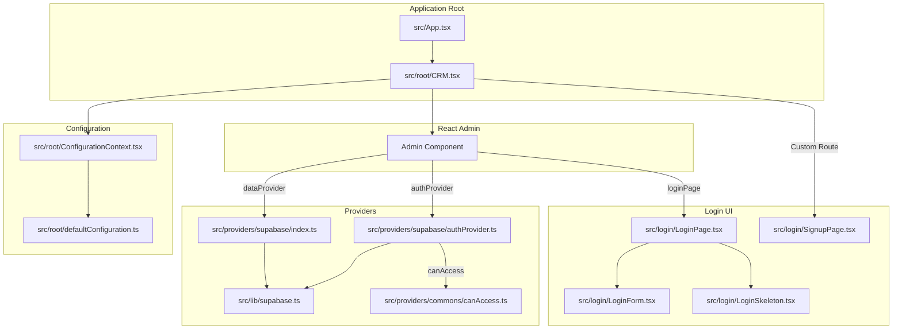

# ForkFlow CRM Authentication System

This document provides a comprehensive overview and setup guide for the login and authentication system for the ForkFlow CRM application. It is intended to help developers understand the structure, purpose, and configuration of the login-related components of the codebase.

## Overview of Login Architecture

The authentication system is built on top of `ra-supabase`, a Supabase adapter for `react-admin`. It provides a complete solution for authentication, including login, logout, session management, and password recovery.

The system is designed to be modular, with a clear separation of concerns between the UI components, the authentication provider, and the Supabase client.

The core of the system is the `authProvider` in `src/providers/supabase/authProvider.ts`, which extends the base `ra-supabase` provider with custom logic for initialization, identity, and access control.

The UI is built with Material-UI and `react-admin` components, and the login flow is managed by the `LoginPage` and `LoginForm` components.

## File-by-File Breakdown

### Providers

#### `src/providers/supabase/authProvider.ts`

*   **Purpose**: This is the core of the authentication system. It extends the `ra-supabase` provider with custom logic for:
    *   **Initialization Check**: The `getIsInitialized` function checks if the application has been initialized by looking for a value in the `init_state` table in Supabase. If the application is not initialized, the user is redirected to the signup page.
    *   **Identity Management**: The `getIdentity` function retrieves the current user's information from the `sales` table and formats it for `react-admin`.
    *   **Access Control**: The `canAccess` function checks if the current user has permission to access a given resource. It uses a placeholder `canAccess` function for now.
    *   **Login/Logout**: The `login` and `logout` functions are extended to clear the cached user data.
*   **Connections**:
    *   Imports `supabase` from `src/lib/supabase.ts`.
    *   Imports `canAccess` from `src/providers/commons/canAccess.ts`.
    *   Used by `src/root/CRM.tsx` as the `authProvider`.

#### `src/providers/supabase/index.ts`

*   **Purpose**: This file exports the `dataProvider` and re-exports everything from `authProvider.ts`. The `dataProvider` extends the base `ra-supabase` data provider with `isInitialized` and `signUp` methods.
*   **Connections**:
    *   Imports `supabase` from `src/lib/supabase.ts`.
    *   Imports `getIsInitialized` from `src/providers/supabase/authProvider.ts`.
    *   Imports `CrmDataProvider` from `src/providers/types.ts`.
    *   Used by `src/root/CRM.tsx` as the `dataProvider`.

#### `src/providers/commons/canAccess.ts`

*   **Purpose**: This file contains a placeholder `canAccess` function that currently allows all access. In a real application, this function would contain the logic for role-based access control.
*   **Connections**:
    *   Used by `src/providers/supabase/authProvider.ts`.

#### `src/providers/types.ts`

*   **Purpose**: This file defines the `CrmDataProvider` type, which extends the base `DataProvider` with the `isInitialized` and `signUp` methods.
*   **Connections**:
    *   Used by `src/providers/supabase/index.ts` and `src/login/LoginPage.tsx`.

### Login UI

#### `src/login/LoginForm.tsx`

*   **Purpose**: This is the main UI component for the login form. It uses `react-admin`'s `Login` and `TextInput` components, with custom styling and logic for submission, loading, and error handling.
*   **Connections**:
    *   Used by `src/login/LoginPage.tsx`.

#### `src/login/LoginPage.tsx`

*   **Purpose**: This component wraps the `LoginForm` and uses `react-query` to check if the application is initialized, showing a skeleton screen while loading and redirecting to the signup page if not initialized.
*   **Connections**:
    *   Uses `src/login/LoginForm.tsx` and `src/login/LoginSkeleton.tsx`.
    *   Used by `src/root/CRM.tsx` as the `loginPage`.

#### `src/login/LoginSkeleton.tsx`

*   **Purpose**: This is a simple skeleton component to show while the login page is loading.
*   **Connections**:
    *   Used by `src/login/LoginPage.tsx`.

#### `src/login/SignupPage.tsx`

*   **Purpose**: This component handles the initial user signup, including the form, mutation, and automatic login after signup.
*   **Connections**:
    *   Uses `src/login/LoginSkeleton.tsx`.
    *   Used by `src/root/CRM.tsx` as a custom route.

### Root Application

#### `src/root/CRM.tsx`

*   **Purpose**: This is the main application component that sets up the `Admin` component from `react-admin` with all the providers, resources, and custom routes.
*   **Connections**:
    *   Imports and uses all the providers and login UI components.
    *   Rendered by `src/App.tsx`.

#### `src/root/ConfigurationContext.tsx`

*   **Purpose**: This file defines the `ConfigurationContext` which is used to provide configuration values to the application.
*   **Connections**:
    *   Used by `src/root/CRM.tsx` and `src/login/SignupPage.tsx`.

#### `src/root/defaultConfiguration.ts`

*   **Purpose**: This file provides the default values for the configuration context.
*   **Connections**:
    *   Used by `src/root/CRM.tsx`.

#### `src/root/i18nProvider.ts`

*   **Purpose**: This file sets up the internationalization provider with English as the default language.
*   **Connections**:
    *   Used by `src/root/CRM.tsx`.

#### `src/App.tsx`

*   **Purpose**: This is the main entry point of the application, and it simply renders the `CRM` component.
*   **Connections**:
    *   Renders `src/root/CRM.tsx`.

### Types

#### `src/types.ts`

*   **Purpose**: This file contains the `SignUpData` type.
*   **Connections**:
    *   Used by `src/login/SignupPage.tsx`.

## Component Relationships

The following Mermaid diagram illustrates the relationships between the main components of the authentication system:



## Authentication Flow

1.  The user navigates to the application.
2.  The `LoginPage` component is rendered.
3.  The `LoginPage` uses `react-query` to call the `isInitialized` function from the `dataProvider`.
4.  If the application is not initialized, the user is redirected to the `/sign-up` page.
5.  On the `/sign-up` page, the user can create the first admin account.
6.  If the application is initialized, the `LoginForm` is displayed.
7.  The user enters their credentials and submits the form.
8.  The `login` function from the `authProvider` is called, which in turn calls the Supabase `signInWithPassword` method.
9.  If the login is successful, the user is redirected to the dashboard.
10. If the login fails, an error notification is displayed.

## Step-by-Step Guide to Creating the Login User Experience

This guide will walk you through the process of creating the login user experience for the ForkFlow CRM application.

### Step 1: Create the Login Form Component

*   **File**: `src/login/LoginForm.tsx`
*   **Purpose**: This component is the main UI for the login form. It includes the email and password fields, the sign-in button, and the "Forgot Password" link.
*   **Reason**: By creating a separate component for the login form, we can easily reuse it and keep our code organized.

### Step 2: Create the Login Page Component

*   **File**: `src/login/LoginPage.tsx`
*   **Purpose**: This component wraps the `LoginForm` and handles the logic for checking if the application is initialized. It also displays a skeleton screen while loading.
*   **Reason**: This component acts as a container for the login form and allows us to add page-level logic, such as checking the application's initialization state.

### Step 3: Create the Login Skeleton Component

*   **File**: `src/login/LoginSkeleton.tsx`
*   **Purpose**: This component displays a skeleton screen while the login page is loading.
*   **Reason**: This provides a better user experience by showing a loading indicator instead of a blank page.

### Step 4: Implement the Authentication Provider

*   **File**: `src/providers/supabase/authProvider.ts`
*   **Purpose**: This file contains the core authentication logic, including the `login` function that is called when the user submits the login form.
*   **Reason**: This centralizes all authentication logic in one place, making it easier to manage and maintain.

### Step 5: Implement the Forgot Password Flow

*   **File**: `src/login/ForgotPasswordPage.tsx` (or use the one from `ra-supabase`)
*   **Purpose**: This page allows users to enter their email address to receive a password reset link.
*   **Reason**: This is a standard feature for any application with user accounts, and it improves the user experience by allowing users to recover their accounts if they forget their password.

### Step 6: Integrate Everything into the Main App

*   **File**: `src/root/CRM.tsx`
*   **Purpose**: This is the main application component where you will set the `loginPage` prop of the `Admin` component to your `LoginPage` component.
*   **Reason**: This is the final step to integrate the login page into the application and make it the default page for unauthenticated users.

## Troubleshooting

Here are some common issues you might encounter when working with the login and authentication system:

### Invalid Supabase Credentials

*   **Symptom**: You get an error message like "Invalid API key" or "Unauthorized".
*   **Solution**: Double-check that your `VITE_SUPABASE_URL` and `VITE_SUPABASE_ANON_KEY` in your `.env` file are correct. Make sure there are no extra spaces or characters.

### Incorrect Table or Column Names

*   **Symptom**: You get an error message like "relation '...' does not exist" or "column '...' of relation '...' does not exist".
*   **Solution**: Make sure the table and column names in your code match the ones in your Supabase database exactly. Remember that Supabase is case-sensitive.

### Redirect Issues

*   **Symptom**: You are stuck in a redirect loop or are not being redirected to the correct page after login.
*   **Solution**: Check the `redirectTo` parameter in the `login` function in `src/providers/supabase/authProvider.ts`. Also, make sure your custom routes in `src/root/CRM.tsx` are set up correctly.

### CORS Errors

*   **Symptom**: You see a CORS error in your browser's console.
*   **Solution**: Make sure you have configured CORS correctly in your Supabase project settings. You should add your application's URL to the list of allowed origins.

### "User not found" or "Invalid password"

*   **Symptom**: You get an error message indicating that the user was not found or the password is a invalid.
*   **Solution**: Double-check that the user exists in the `auth.users` table in your Supabase database and that you are using the correct email and password.

## Supabase Configuration

To get this project running, you'll need to set up a Supabase project and configure it correctly.

### Step 1: Create a Supabase Project

1.  Go to [supabase.com](https://supabase.com/) and create a new project.
2.  Give your project a name and a database password.
3.  Choose a region and a pricing plan (the free plan is sufficient for this project).

### Step 2: Get Your API Credentials

1.  In your Supabase project dashboard, go to **Project Settings** > **API**.
2.  You will find your **Project URL** and your `anon` **public** key.
3.  Create a `.env` file in the root of this project and add your credentials like this:

    ```
    VITE_SUPABASE_URL=https://your-project-id.supabase.co
    VITE_SUPABASE_ANON_KEY=your-anon-public-key-here
    VITE_IS_DEMO=false
    ```

### Step 3: Create Required Database Tables

You will need to create two tables in your Supabase database for the authentication system to work correctly: `init_state` and `sales`.

#### `init_state` Table

This table is used to check if the application has been initialized.

```sql
-- Create init_state table
CREATE TABLE init_state (
    id SERIAL PRIMARY KEY,
    is_initialized BOOLEAN DEFAULT FALSE,
    created_at TIMESTAMP WITH TIME ZONE DEFAULT NOW()
);

-- Insert initial record
INSERT INTO init_state (is_initialized) VALUES (FALSE);
```

### Table 2: `sales` 
This table stores user profile information for the CRM system.

```sql
-- Create sales table
CREATE TABLE sales (
    id UUID PRIMARY KEY DEFAULT gen_random_uuid(),
    first_name TEXT NOT NULL,
    last_name TEXT NOT NULL,
    email TEXT UNIQUE NOT NULL,
    avatar JSONB,
    administrator BOOLEAN DEFAULT FALSE,
    user_id UUID REFERENCES auth.users(id) ON DELETE CASCADE,
    created_at TIMESTAMP WITH TIME ZONE DEFAULT NOW(),
    updated_at TIMESTAMP WITH TIME ZONE DEFAULT NOW()
);

-- Create indexes for better performance
CREATE INDEX idx_sales_user_id ON sales(user_id);
CREATE INDEX idx_sales_email ON sales(email);
```

### How to Run These SQL Commands

1. In your Supabase dashboard, go to **SQL Editor**
2. Click **New query**
3. Copy and paste the SQL commands above
4. Click **Run** to execute each table creation script

## Step 4: Configure Authentication

### Enable Email Authentication
1. Go to **Authentication** → **Providers** in your Supabase dashboard
2. Find the **Email** provider and ensure it's **enabled**
3. Configure the following settings:
   - **Enable email confirmations**: Recommended for production
   - **Enable email change confirmations**: Recommended for production
   - **Secure email change**: Enabled (default)

### Configure Email Templates (Optional)
1. Go to **Authentication** → **Email Templates**
2. Customize the email templates if desired:
   - **Confirm signup**
   - **Reset password**
   - **Magic link**
   - **Change email address**

## Step 5: Set Up Row Level Security (RLS)

Enable RLS policies to secure your data:

```sql
-- Enable RLS on sales table
ALTER TABLE sales ENABLE ROW LEVEL SECURITY;

-- Policy: Users can only see their own profile
CREATE POLICY "Users can view own profile" ON sales
    FOR SELECT USING (auth.uid() = user_id);

-- Policy: Users can update own profile
CREATE POLICY "Users can update own profile" ON sales
    FOR UPDATE USING (auth.uid() = user_id);

-- Policy: Allow insert during signup process
CREATE POLICY "Allow profile creation" ON sales
    FOR INSERT WITH CHECK (auth.uid() = user_id);

-- Enable RLS on init_state table
ALTER TABLE init_state ENABLE ROW LEVEL SECURITY;

-- Policy: Allow reading init state for all authenticated users
CREATE POLICY "Allow reading init state" ON init_state
    FOR SELECT TO authenticated
    USING (true);

-- Policy: Only allow updating init state by service role
CREATE POLICY "Allow updating init state" ON init_state
    FOR UPDATE TO service_role
    USING (true);
```

## Step 6: Test Your Setup

### Start the Development Server
```bash
# Install dependencies (if not already done)
npm install

# Start the development server
npm run dev
# OR
make start-app
```

### Test the Authentication Flow

1. **First Visit**: Navigate to `http://localhost:5173`
   - You should be redirected to `/sign-up` (since app is not initialized)
   
2. **Create First Admin User**:
   - Fill in the signup form with your details
   - Click "Create account"
   - You should be automatically logged in and redirected to `/contacts`

3. **Test Login**:
   - Log out from the application
   - Navigate back to the login page
   - Enter your credentials
   - You should be successfully logged in

4. **Test Forgot Password**:
   - Click "Forgot your password?" on the login form
   - Enter your email address
   - Check your email for the reset link

## Step 7: Verify Database Records

Check that everything is working by examining your database:

```sql
-- Check if app is marked as initialized
SELECT * FROM init_state;

-- Check if user record was created
SELECT id, first_name, last_name, email, administrator, created_at 
FROM sales;

-- Check auth.users table (Supabase system table)
SELECT id, email, created_at, email_confirmed_at 
FROM auth.users;
```

## Troubleshooting

### Common Issues

#### 1. "Invalid API key" Error
- **Cause**: Using demo/placeholder credentials in `.env`
- **Solution**: Replace with your real Supabase URL and anon key

#### 2. "relation 'sales' does not exist"
- **Cause**: Database tables haven't been created
- **Solution**: Run the SQL commands in Step 3

#### 3. "relation 'init_state' does not exist"
- **Cause**: Missing init_state table
- **Solution**: Create the init_state table using the SQL in Step 3

#### 4. Stuck in redirect loop
- **Cause**: RLS policies may be too restrictive or missing
- **Solution**: Verify RLS policies from Step 5 are applied correctly

#### 5. Email not working for password reset
- **Cause**: Email provider not configured or SMTP settings missing
- **Solution**: Check Authentication → Providers settings in Supabase

### Getting Help

1. Check the [Supabase documentation](https://supabase.com/docs)
2. Review the application logs in browser developer tools
3. Check Supabase project logs in the dashboard
4. Refer to the detailed README_logon.md for architecture information

## Security Best Practices

### For Development
- Keep your `.env` file in `.gitignore` (already configured)
- Use the free tier Supabase project for development
- Enable email confirmation for testing

### For Production
- Use environment variables for sensitive data
- Enable all email confirmations
- Set up proper SMTP for reliable email delivery
- Consider adding two-factor authentication
- Regularly review and update RLS policies
- Monitor authentication logs

## Next Steps

After successfully setting up authentication:

1. **Customize the UI**: Modify login forms in `src/login/` to match your branding
2. **Add Social Providers**: Configure Google, GitHub, or other OAuth providers
3. **Implement Role Management**: Extend the user management system
4. **Set Up Email Templates**: Customize the authentication emails
5. **Add Security Features**: Implement session timeout, password policies, etc.

Your ForkFlow CRM login system is now ready to use! 🎉
